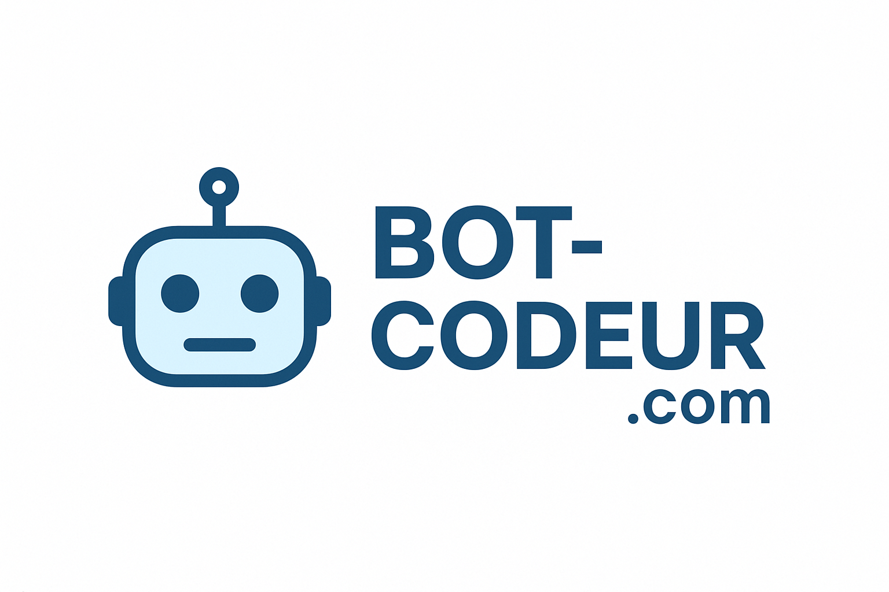

# 🤖 BOT-Codeur.com

<p align="center">
  
</p>

<p align="center">
    Un bot intelligent pour automatiser votre prospection sur Codeur.com !
</p>

---

## 🚀 Description

Ce projet est un bot conçu pour automatiser les interactions sur la plateforme `codeur.com`. Il a pour but de vous faire gagner du temps en répondant automatiquement aux appels d'offres et aux messages des clients grâce à une intelligence artificielle locale (Ollama).

Le bot est entièrement configurable et contrôlable via une interface web moderne et intuitive.

## ✨ Features

- **Interface de Configuration Web :** Une page web pour configurer et piloter le bot.
- **Exécution Automatique Intelligente :** Configurez le bot pour qu'il s'exécute à un intervalle de temps défini. Le planificateur attend la fin de chaque cycle pour éviter les blocages.
- **Journalisation en Temps Réel :** Suivez l'activité du bot en direct depuis l'interface web grâce à un fichier de log.
- **Analyse des Données :**
  - Extraction des conversations et des projets.
  - Gestion d'état pour ne traiter chaque projet qu'une seule fois.
- **Sauvegarde d'État par Étape :** Le fichier `projects.json` est sauvegardé après chaque phase (scraping, analyse, etc.) pour une meilleure résilience.
- **Envoi de Propositions en Plusieurs Parties :** Gère automatiquement les messages de plus de 1000 caractères en les envoyant en tant que commentaire.
- **IA Personnalisable :** Définissez la personnalité du bot et sa logique d'analyse et de réponse via des prompts.
- **Tests Unitaires :** Une suite de tests avec Jest pour garantir la stabilité et éviter les régressions.
- **Containerisation :** Le projet est entièrement dockerisé pour un déploiement facile.

## 🛠️ Tech Stack

- **Backend :** Node.js, Express
- **Frontend :** HTML, Bootstrap, Bootstrap Icons
- **Parsing HTML :** Cheerio
- **Tests :** Jest, Supertest
- **IA :** Ollama
- **Containerisation :** Docker, Docker Compose

## 📋 Prérequis

Avant de commencer, assurez-vous d'avoir installé [Docker](https://www.docker.com/get-started) sur votre machine.

## ⚡ Installation & Démarrage Rapide

1.  **Clonez le projet.**
2.  **Lancez les services :** `docker-compose up -d --build`.
3.  **C'est prêt !** 🎉

## ⚙️ Utilisation

1.  **Accédez à l'interface :** `http://localhost:3000`.
2.  **Configurez le bot :** Remplissez le cookie, les prompts, et sauvegardez.
3.  **Lancez le Bot :** Cliquez sur **"Démarrer le Bot"** pour une exécution manuelle ou configurez l'exécution automatique.

## 🧪 Tests

Pour garantir la qualité du code, des tests ont été mis en place. Pour les lancer, placez-vous dans le dossier `webapp` et exécutez la commande :

```bash
npm test
```

## 📈 Statut du Projet

- [x] **Phase 1 : Infrastructure et Configuration (Terminée)**
- [x] **Phase 2 : Analyse des Données et Tests (Terminée)**
- [x] **Phase 3 : Intégration avec Ollama (Terminée)**
- [x] **Phase 4 : Action du Bot (Réponse) (Terminée)**
  - [x] Génération de devis et message de réponse pour les projets pertinents.
  - [x] Implémentation de la logique pour poster la réponse sur `codeur.com`.
  - [x] Gestion des réponses en plusieurs parties (si > 1000 caractères).
- [x] **Phase 5 : Améliorations et Fiabilité (Terminée)**
  - [x] Ajout de la journalisation (logging) en direct.
  - [x] Ajout d'un planificateur intelligent pour l'exécution automatique.
  - [x] Amélioration de la résilience avec la sauvegarde par étape.

---

*Développé avec ❤️ pour les freelances.*
